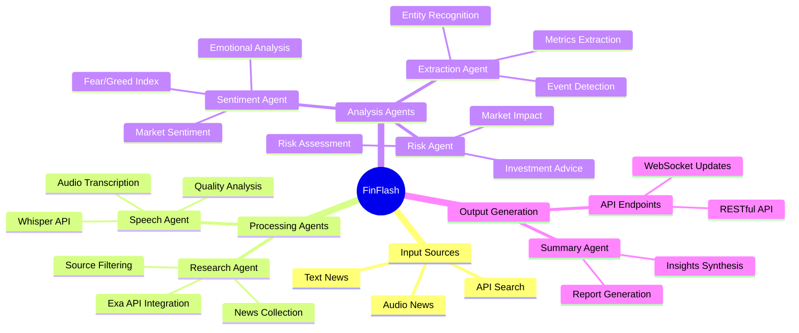
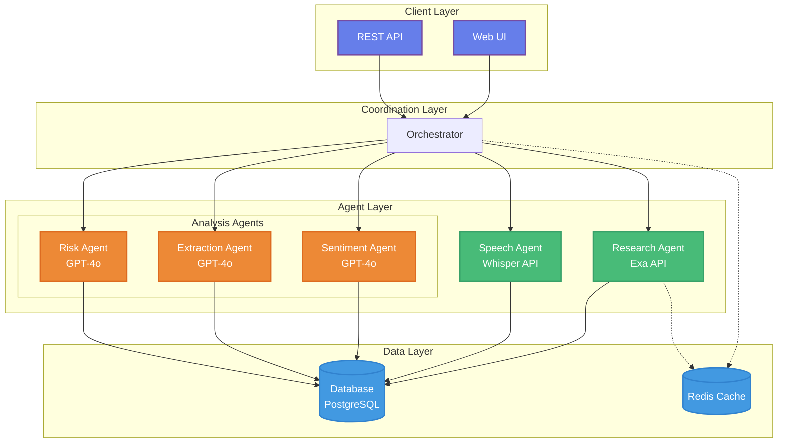
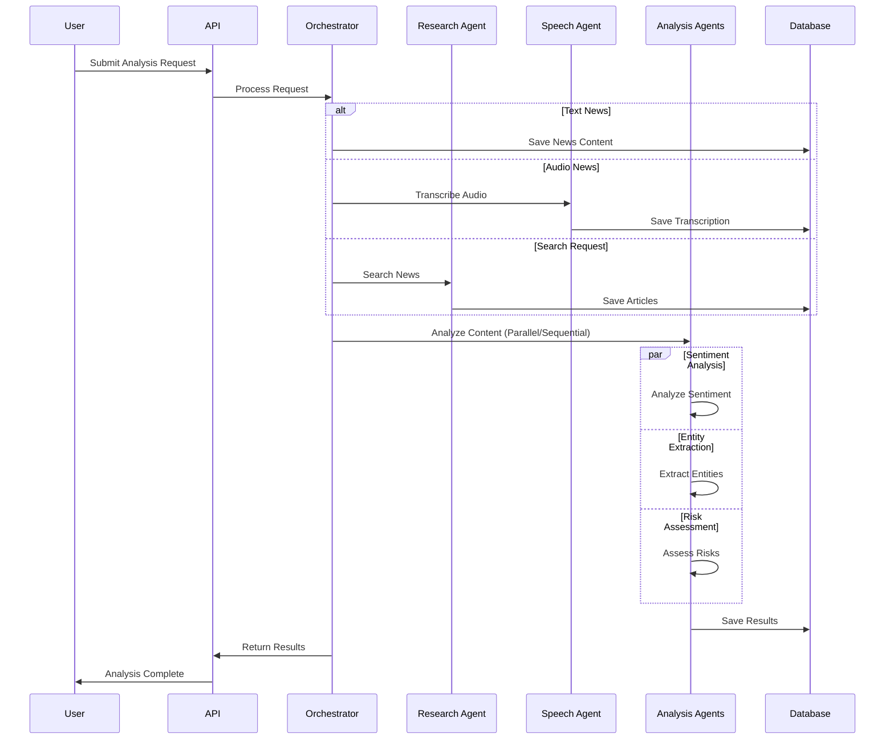

# FinFlash - Financial News Multi-Agent Analysis System

An AI-powered multi-agent system for real-time financial news analysis using OpenAI GPT-4o and Exa API.

## Features

### Multi-Agent Architecture



- **Multi-Agent Architecture**: Six specialized AI agents working together
  - Research Agent: Searches and collects financial news using Exa API
  - Speech Agent: Transcribes audio news using OpenAI Whisper
  - Sentiment Agent: Analyzes market sentiment and fear/greed indicators
  - Extraction Agent: Extracts entities, events, and financial metrics
  - Risk Agent: Assesses risks and provides investment recommendations
  - Summary Agent: Generates comprehensive analysis reports

- **Real-time Processing**: Fast news acquisition and analysis with WebSocket support
- **Flexible Analysis Modes**: Sequential, parallel, or adaptive processing
- **Comprehensive API**: RESTful endpoints for all operations
- **Batch Processing**: Schedule automated news crawling and analysis

## Quick Start

### Prerequisites

- Python 3.9 or higher
- Redis (optional for caching)
- PostgreSQL (optional, SQLite by default)
- OpenAI API Key
- Exa API Key

### Installation

1. Clone the repository:
```bash
git clone https://github.com/yourusername/FinFlash.git
cd FinFlash
```

2. Run setup (Windows):
```bash
scripts\setup.bat
```

   For Linux/Mac:
```bash
python -m venv venv
source venv/bin/activate
pip install -r requirements.txt
```

3. Configure environment:
```bash
# Copy example configuration
cp .env.example .env

# Edit .env file with your API keys
# Required: OPENAI_API_KEY, EXA_API_KEY
```

4. Run the application:
```bash
python run.py
```

### Additional Commands

```bash
python run.py --help         # Show all options
python run.py --port 8080    # Run on different port
python run.py --debug        # Run in debug mode
python run.py --clean        # Clean project files
python run.py --test         # Run tests
python run.py --batch        # Run batch processing
```

## Configuration System

FinFlash uses a flexible YAML-based configuration system with environment variable overrides:

### Configuration Files

- `config/config.yaml` - Base configuration
- `config/development.yaml` - Development overrides
- `config/production.yaml` - Production settings
- `config/testing.yaml` - Test configuration

### Environment Variables

Key environment variables (set in `.env`):

```bash
# API Keys (Required)
OPENAI_API_KEY=your-openai-key
EXA_API_KEY=your-exa-key

# Flask Configuration
FLASK_ENV=development
SECRET_KEY=your-secret-key

# Database (Optional)
DATABASE_URL=sqlite:///financial_news.db

# Redis (Optional)
REDIS_URL=redis://localhost:6379/0
```

## API Usage

### Analyze Text News

```bash
curl -X POST http://localhost:5000/api/analysis/text \
  -H "Content-Type: application/json" \
  -d '{
    "content": "Apple reports record Q4 earnings...",
    "source": "Reuters"
  }'
```

### Analyze Audio News

```bash
curl -X POST http://localhost:5000/api/analysis/audio \
  -F "file=@news_audio.mp3" \
  -F "source=podcast"
```

### Search and Analyze

```bash
curl -X POST http://localhost:5000/api/analysis/search \
  -H "Content-Type: application/json" \
  -d '{
    "query": "Tesla earnings report",
    "num_results": 10
  }'
```

## Response Format

All analysis endpoints return a comprehensive result:

```json
{
  "news_id": "uuid",
  "status": "completed",
  "news": {
    "title": "...",
    "content": "...",
    "source": "..."
  },
  "analyses": {
    "sentiment": {
      "sentiment": "positive",
      "score": 0.85,
      "fear_greed_index": 72
    },
    "extraction": {
      "entities": {...},
      "events": [...],
      "metrics": {...}
    },
    "risk": {
      "risk_level": "medium",
      "impact_score": 6.5,
      "recommendations": [...]
    }
  },
  "summary": {
    "executive_summary": "...",
    "key_insights": [...],
    "action_items": [...]
  }
}
```

## Project Structure

```
FinFlash/
├── run.py              # Main application entry point
├── requirements.txt    # Python dependencies
├── .env.example       # Environment variables template
├── README.md          # This file
├── LICENSE            # MIT License
│
├── agents/            # AI Agents
│   ├── baseAgents.py
│   ├── orchestrator.py
│   ├── researchAgent.py
│   ├── speechAgent.py
│   ├── sentimentAgent.py
│   ├── extractionAgent.py
│   ├── riskAgent.py
│   └── summaryAgent.py
│
├── app/               # Flask Application
│   ├── main.py       # Flask app initialization
│   ├── config.py     # App configuration
│   ├── routes/       # API endpoints
│   │   ├── analysis.py
│   │   ├── news.py
│   │   ├── batch.py
│   │   └── reports.py
│   ├── templates/    # HTML templates
│   └── static/       # CSS/JS/Images
│
├── config/           # Configuration Files
│   ├── config.yaml   # Base configuration
│   ├── development.yaml
│   ├── production.yaml
│   ├── testing.yaml
│   └── config_loader.py
│
├── core/             # Core Components
│   └── database.py   # Database models
│
├── services/         # External Services
│   ├── openaiService.py
│   ├── exaService.py
│   └── rateLimiter.py
│
├── scripts/          # Utility Scripts
│   └── setup.bat     # Windows setup script
│
└── docker/           # Docker Configuration
    ├── Dockerfile
    └── docker-compose.yml
```

## System Architecture



### Processing Flow



## Docker Deployment

```bash
# Build and run with Docker Compose
docker-compose up -d

# View logs
docker-compose logs -f

# Stop services
docker-compose down
```

## Testing

```bash
# Run all tests
python run.py --test

# Run specific test suite
pytest tests/unit -v
pytest tests/integration -v

# Run with coverage
pytest --cov=. --cov-report=html
```

## License

This project is licensed under the MIT License - see the LICENSE file for details.

## Contributing

1. Fork the repository
2. Create your feature branch (`git checkout -b feature/amazing-feature`)
3. Commit your changes (`git commit -m 'Add amazing feature'`)
4. Push to the branch (`git push origin feature/amazing-feature`)
5. Open a Pull Request

## Support

For issues and questions:
- Create an issue on GitHub
- Check the logs in `logs/` directory
- Review configuration in `config/` directory

## Acknowledgments

- OpenAI for GPT-4o and Whisper APIs
- Exa for intelligent news search
- Flask community for the excellent web framework 