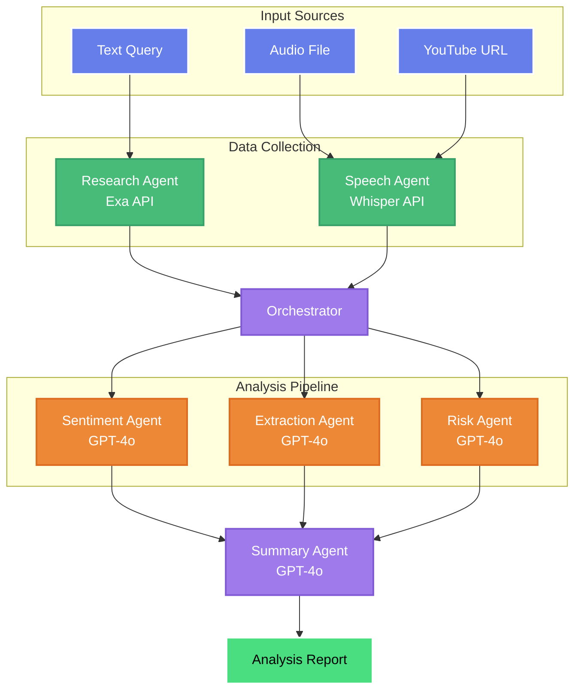

# FinFlash - Financial News Multi-Agent Analysis System

An AI-powered multi-agent system for real-time financial news analysis using OpenAI GPT-4o and Exa API.

## Quick Start

### Prerequisites
- Python 3.9+
- OpenAI API Key
- Exa API Key
- Redis (optional)
- PostgreSQL (optional)

### Installation

1. **Clone and Setup**
```bash
git clone https://github.com/yourusername/FinFlash.git
cd FinFlash

# Windows
scripts\setup.bat

# Linux/Mac
python -m venv venv
source venv/bin/activate
pip install -r requirements.txt
```

2. **Configure Environment**
```bash
cp .env.example .env
# Edit .env with your API keys
```

3. **Run Application**
```bash
python run.py                # Default
python run.py --port 8080    # Custom port
python run.py --debug        # Debug mode
```

## System Architecture



## Multi-Agent System

### Agent Roles
- **Research Agent**: Searches and collects financial news using Exa API
- **Speech Agent**: Transcribes audio/video content using Whisper API
- **Sentiment Agent**: Analyzes market sentiment and fear/greed indicators
- **Extraction Agent**: Extracts entities, events, and financial metrics
- **Risk Agent**: Assesses risks and provides investment recommendations
- **Summary Agent**: Generates comprehensive analysis reports

### Key Features
- Real-time news acquisition and analysis
- Flexible processing modes (sequential/parallel/adaptive)
- Comprehensive RESTful API
- Batch processing capabilities
- WebSocket support for live updates

## API Usage

### Text Analysis
```bash
curl -X POST http://localhost:5000/api/analysis/text \
  -H "Content-Type: application/json" \
  -d '{
    "content": "Apple reports record Q4 earnings...",
    "source": "Reuters"
  }'
```

### Audio Analysis
```bash
curl -X POST http://localhost:5000/api/analysis/audio \
  -F "file=@news_audio.mp3" \
  -F "source=podcast"
```

### Search & Analyze
```bash
curl -X POST http://localhost:5000/api/analysis/search \
  -H "Content-Type: application/json" \
  -d '{
    "query": "Tesla earnings report",
    "num_results": 10
  }'
```

### Response Format
```json
{
  "news_id": "uuid",
  "status": "completed",
  "analyses": {
    "sentiment": {
      "sentiment": "positive",
      "score": 0.85,
      "fear_greed_index": 72
    },
    "extraction": {
      "entities": {...},
      "events": [...],
      "metrics": {...}
    },
    "risk": {
      "risk_level": "medium",
      "impact_score": 6.5,
      "recommendations": [...]
    }
  },
  "summary": {
    "executive_summary": "...",
    "key_insights": [...],
    "action_items": [...]
  }
}
```

## Configuration

### Environment Variables (.env)
```bash
# Required
OPENAI_API_KEY=your-openai-key
EXA_API_KEY=your-exa-key

# Optional
DATABASE_URL=sqlite:///financial_news.db
REDIS_URL=redis://localhost:6379/0
SECRET_KEY=your-secret-key
```

### Configuration Files
- `config/config.yaml` - Base configuration
- `config/development.yaml` - Development settings
- `config/production.yaml` - Production settings
- `config/testing.yaml` - Test configuration

## Project Structure

```
FinFlash/
├── agents/            # AI Agents
├── app/               # Flask Application
│   ├── routes/        # API endpoints
│   ├── templates/     # HTML templates
│   └── static/        # CSS/JS/Images
├── config/            # Configuration files
├── core/              # Core components
├── services/          # External services
├── scripts/           # Utility scripts
└── docker/            # Docker configuration
```

## Docker Deployment

```bash
# Build and run
docker-compose up -d

# View logs
docker-compose logs -f

# Stop services
docker-compose down
```

## Testing

```bash
# Run all tests
python run.py --test

# Run with coverage
pytest --cov=. --cov-report=html
```

## License

MIT License - see [LICENSE](LICENSE) file for details.

## Contributing

1. Fork the repository
2. Create feature branch (`git checkout -b feature/amazing-feature`)
3. Commit changes (`git commit -m 'Add amazing feature'`)
4. Push to branch (`git push origin feature/amazing-feature`)
5. Open Pull Request

## Support

- Create an issue on GitHub
- Check logs in `logs/` directory
- Review configuration in `config/` directory 