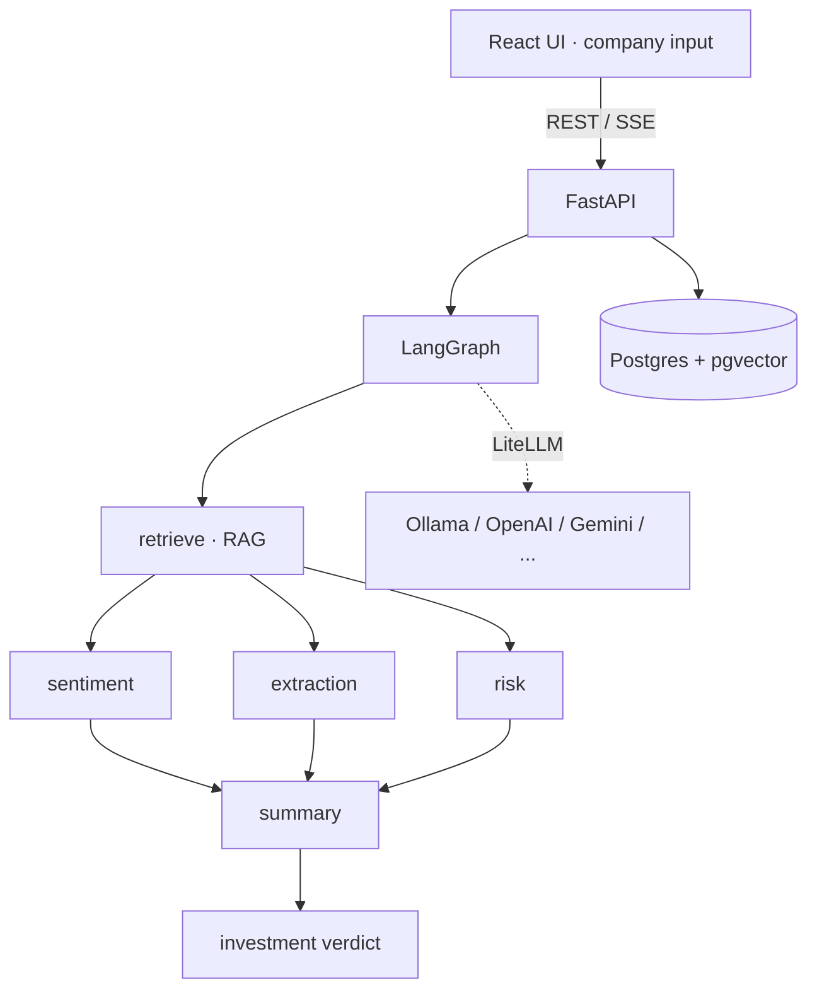

# FinFlash

**Type in a company, and a team of AI analysts tells you whether it's worth investing in.**

FinFlash automatically pulls a company's latest news, runs it through several AI analysts
in parallel (sentiment, entity extraction, risk, summary), and returns a one-line
investment verdict — **BUY / HOLD / SELL** — with a confidence score, rationale,
catalysts, and risks. It can run fully local and free (Ollama + Google News), or with your
own cloud model keys.

---

## Features

- **Company investment verdict** — enter a name/ticker → auto-fetch news → multi-agent analysis → BUY/HOLD/SELL card
- **Free & local-capable** — Google News RSS for search (no key), self-hosted Ollama for models (no key)
- **Bring-your-own-key (BYO)** — or use OpenAI / Anthropic / Gemini / DeepSeek with your own key, isolated per request
- **Parallel multi-agent** — sentiment / extraction / risk run concurrently, summary joins (LangGraph)
- **Structured outputs** — every agent returns Pydantic-validated JSON (no brittle string parsing)
- **RAG memory** — news is embedded into pgvector and recalled as historical context
- **Observable / metered / tested** — LangSmith tracing, per-key daily quotas, pytest
- **Embeddable widget** — single-file JS bundle any site can drop in

## One-click start

```powershell
# Windows
./start.ps1            # build + start everything, prints the URLs
./start.ps1 down       # stop
./start.ps1 local      # no Docker — run uv + pnpm in two windows
```

```bash
# Linux / macOS
./start.sh             # same; also ./start.sh down | logs | local
```

Then open **http://localhost:8080**, go to "Company analysis", and enter a company name.
(API docs: http://localhost:8000/docs)

> **No key needed by default**: search uses free RSS, models use the server default
> (which can be a local Ollama). To use a cloud model, paste your own key into the
> "model-provider API key" field in the UI.

## Configure models

Edit `.env` (the `start` scripts copy it from the template). Three typical setups:

```bash
# A) Fully local & free (self-hosted Ollama)
OLLAMA_API_BASE=http://your-ollama-host:11434
DEFAULT_LLM_MODEL=ollama_chat/gemma3:12b
DEFAULT_EMBEDDING_MODEL=ollama/embeddinggemma:latest
EMBEDDING_DIM=768
LLM_MAX_CONCURRENCY=1        # small box: serialize calls so it isn't overloaded

# B) Cloud default (server-side key)
DEFAULT_LLM_MODEL=gemini/gemini-2.5-flash
GEMINI_API_KEY=...

# C) No server key → each user brings their own key in the UI (BYO)
```

Callers can also override a single request via HTTP headers: `X-LLM-Provider` /
`X-LLM-Model` / `X-LLM-Key` / `X-LLM-Api-Base`.

## News search

`/api/analysis/company` and `/api/analysis/search` use **Google News RSS by default
(no key)**; set `EXA_API_KEY` to automatically upgrade to Exa full-text search.

## Authentication

**Off by default** (local/self-host needs no key). For a public deployment set
`REQUIRE_API_KEY=true` — a bootstrap access key is then minted and logged once on first
start (only its hash is stored), and `/api/*` requires an `X-API-Key` header.

## Key endpoints

| Method | Path | Purpose |
|--------|------|---------|
| POST | `/api/analysis/company` | **Company → investment verdict (buy/hold/sell)** |
| POST | `/api/analysis/text` | Analyze a piece of text |
| POST | `/api/analysis/stream` | Same, streamed via SSE (per-node progress) |
| POST | `/api/analysis/search` | Search news and analyze each article |
| POST | `/api/analysis/audio` / `youtube` | Audio / YouTube → transcribe → analyze |
| GET | `/api/news`, `/api/news/{id}` | Browse stored news and analyses |
| GET | `/health` | Health check |

```bash
curl -X POST http://localhost:8000/api/analysis/company \
  -H "Content-Type: application/json" \
  -d '{"company": "Tesla", "num_results": 5}'
```

## Architecture


```mermaid
graph TB
    UI[React UI · company input] -->|REST / SSE| API[FastAPI]
    API --> Graph[LangGraph]
    Graph --> Retrieve[retrieve · RAG]
    Retrieve --> Sentiment[sentiment]
    Retrieve --> Extraction[extraction]
    Retrieve --> Risk[risk]
    Sentiment --> Summary[summary]
    Extraction --> Summary
    Risk --> Summary
    Summary --> Verdict[investment verdict]
    Graph -. LiteLLM .-> Providers[Ollama / OpenAI / Gemini / ...]
    API --> DB[(Postgres + pgvector)]
```

## Development

```bash
# Backend (uv · ruff · ty · pytest)
cd backend && uv sync --extra dev
uv run uvicorn app.main:app --reload
uv run ruff check . && uv run ty check && uv run pytest

# Frontend (pnpm · Vite)
cd frontend && pnpm install
pnpm dev            # http://localhost:5173 (proxies /api -> :8000)
pnpm build          # production build
pnpm build:widget   # embeddable widget
```

## Disclaimer

Output is AI-generated research over public news, **not personalized investment advice**.
Do your own due diligence.

## License

MIT — see [LICENSE](LICENSE).
