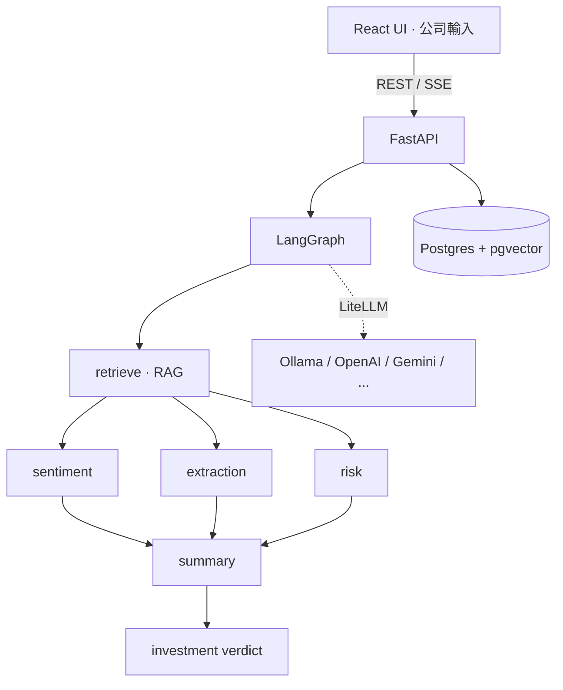

# ⚡ FinFlash

**輸入一家公司，AI 多分析師告訴你「值不值得投資」。**

FinFlash 會自動抓取一家公司的最新新聞，交給多個 AI 分析師（情緒、實體擷取、風險、
彙整）平行分析，最後給出一句話的投資結論 —— **BUY / HOLD / SELL**，附信心、理由、
催化劑與風險。可完全本地、免費運行（Ollama + Google News），也能用你自己的雲端模型金鑰。

> 2026 重寫版：從單檔 Flask 改為 **FastAPI + LangGraph** 後端、**LiteLLM** 多供應商
> （自帶金鑰）、**pgvector** RAG 記憶、結構化輸出，以及元件化的 **React (Vite)** 前端。

---

## 特色

- **公司投資結論**：輸入公司名／股票代號 → 自動搜新聞 → 多 agent 分析 → BUY/HOLD/SELL 卡片
- **免費可本地**：搜尋用 Google News RSS（免金鑰）、模型用自架 Ollama（免金鑰）
- **自帶金鑰（BYO）**：也可選 OpenAI / Anthropic / Gemini / DeepSeek，填自己的 key，每次請求獨立
- **多 agent 平行**：sentiment / extraction / risk 平行跑，summary 收斂（LangGraph）
- **結構化輸出**：每個 agent 回傳經 Pydantic 驗證的 JSON（非脆弱的字串解析）
- **RAG 記憶**：新聞向量化存 pgvector，分析時引用歷史脈絡
- **可觀測 / 有額度 / 有測試**：LangSmith tracing、每金鑰每日額度、pytest
- **可嵌入 widget**：單檔 JS bundle，第三方網站可直接整合

## 一鍵啟動

```powershell
# Windows
./start.ps1            # 建置 + 啟動全部，印出網址
./start.ps1 down       # 停止
./start.ps1 local      # 不用 Docker，直接 uv + pnpm 雙視窗
```

```bash
# Linux / macOS
./start.sh             # 同上；另有 ./start.sh down | logs | local
```

啟動後開 **http://localhost:8080**，切到「公司投資分析」，輸入公司名即可。
（API 文件：http://localhost:8000/docs）

> 預設**不需要任何金鑰**：搜尋走免費 RSS、模型走伺服器預設（可設成本地 Ollama）。
> 想用雲端模型時，在 UI 的「你的模型供應商 API Key」填自己的 key。

## 設定模型

編輯 `.env`（`start` 會從範本複製）。三種典型配置：

```bash
# A) 完全本地、免費（自架 Ollama）
OLLAMA_API_BASE=http://your-ollama-host:11434
DEFAULT_LLM_MODEL=ollama_chat/gemma3:12b
DEFAULT_EMBEDDING_MODEL=ollama/embeddinggemma:latest
EMBEDDING_DIM=768
LLM_MAX_CONCURRENCY=1        # 小機器：序列化呼叫避免壓垮

# B) 雲端預設（伺服器端金鑰）
DEFAULT_LLM_MODEL=gemini/gemini-2.5-flash
GEMINI_API_KEY=...

# C) 不設伺服器金鑰 → 每位使用者在 UI 自帶 key（BYO）
```

使用者也可用 HTTP header 覆寫單次請求：`X-LLM-Provider` / `X-LLM-Model` /
`X-LLM-Key` / `X-LLM-Api-Base`。

## 搜尋來源

`/api/analysis/company` 與 `/api/analysis/search` 預設用 **Google News RSS（免金鑰）**；
設 `EXA_API_KEY` 即自動升級為 Exa 全文搜尋。

## 認證

預設**關閉**（本地／自架免金鑰）。對外公開時設 `REQUIRE_API_KEY=true`，系統會在首次
啟動產生並記錄一把存取金鑰（只存雜湊），之後 `/api/*` 需帶 `X-API-Key`。

## 主要 API

| Method | Path | 用途 |
|--------|------|------|
| POST | `/api/analysis/company` | **輸入公司 → 投資結論（buy/hold/sell）** |
| POST | `/api/analysis/text` | 分析一段文字 |
| POST | `/api/analysis/stream` | 同上，SSE 逐節點進度 |
| POST | `/api/analysis/search` | 搜新聞並逐篇分析 |
| POST | `/api/analysis/audio` / `youtube` | 音檔／YouTube → 轉錄 → 分析 |
| GET | `/api/news`, `/api/news/{id}` | 瀏覽已存新聞與分析 |
| GET | `/health` | 健康檢查 |

```bash
curl -X POST http://localhost:8000/api/analysis/company \
  -H "Content-Type: application/json" \
  -d '{"company": "Tesla", "num_results": 5}'
```

## 架構


```mermaid
graph TB
    UI[React UI · 公司輸入] -->|REST / SSE| API[FastAPI]
    API --> Graph[LangGraph]
    Graph --> Retrieve[retrieve · RAG]
    Retrieve --> Sentiment[sentiment]
    Retrieve --> Extraction[extraction]
    Retrieve --> Risk[risk]
    Sentiment --> Summary[summary]
    Extraction --> Summary
    Risk --> Summary
    Summary --> Verdict[investment verdict]
    Graph -. LiteLLM .-> Providers[Ollama / OpenAI / Gemini / ...]
    API --> DB[(Postgres + pgvector)]
```

## 開發

```bash
# 後端 (uv · ruff · ty · pytest)
cd backend && uv sync --extra dev
uv run uvicorn app.main:app --reload
uv run ruff check . && uv run ty check && uv run pytest

# 前端 (pnpm · Vite)
cd frontend && pnpm install
pnpm dev            # http://localhost:5173 (代理 /api -> :8000)
pnpm build          # 正式版
pnpm build:widget   # 可嵌入 widget
```

## 免責聲明

本專案輸出為 AI 對公開新聞的研究分析，**非個人化投資建議**；投資請自行評估風險。

## License

MIT — 見 [LICENSE](LICENSE)。
